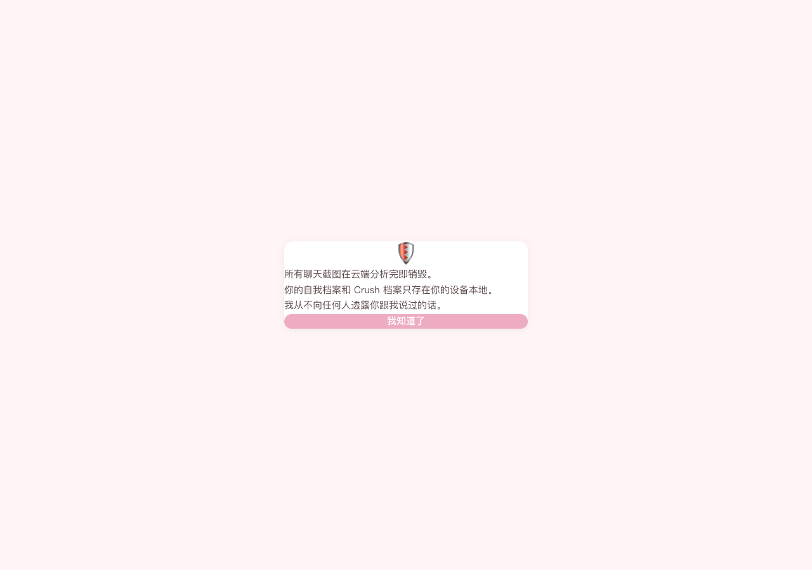
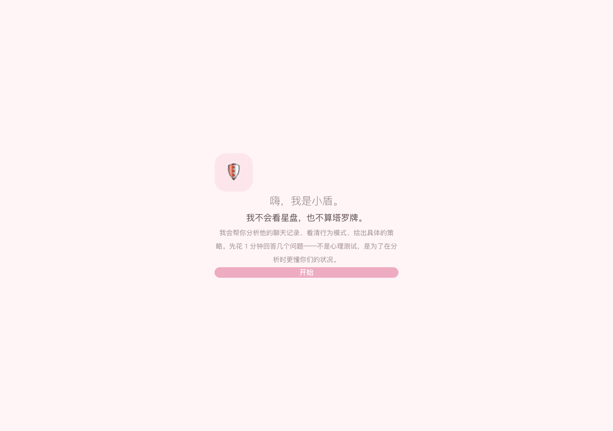
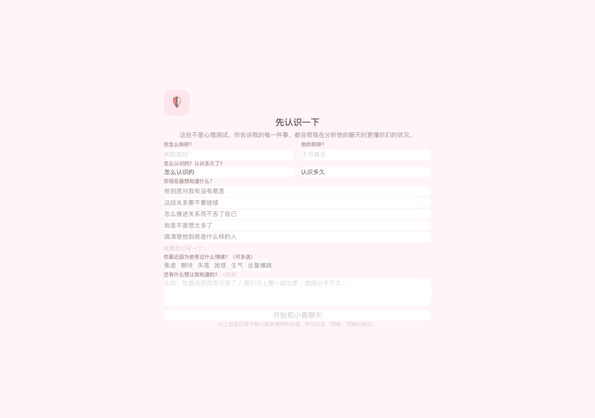
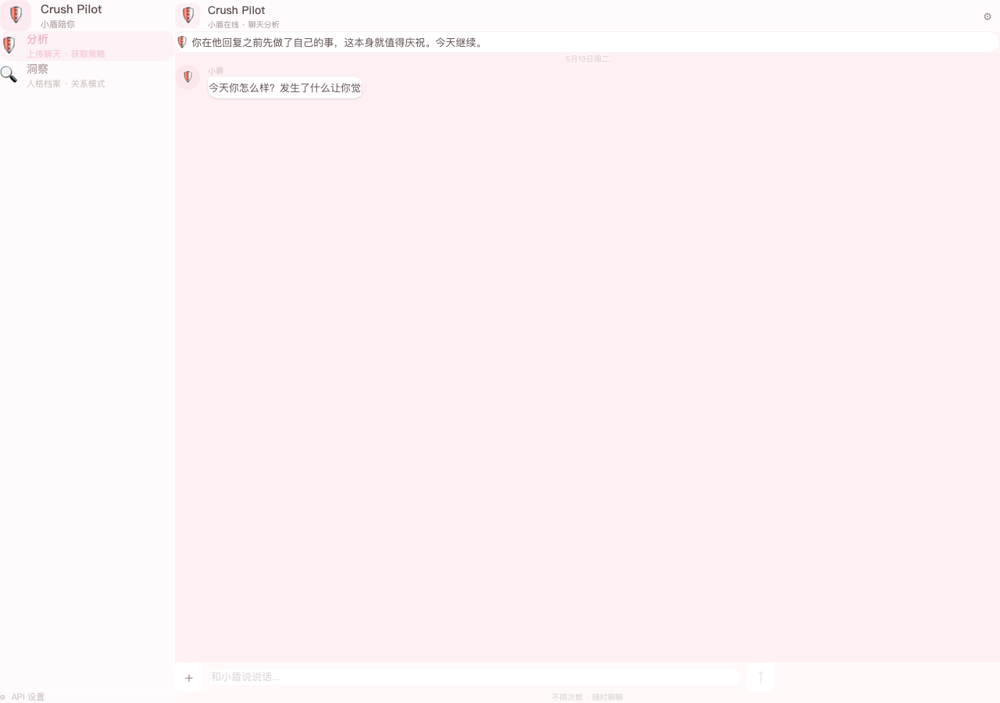
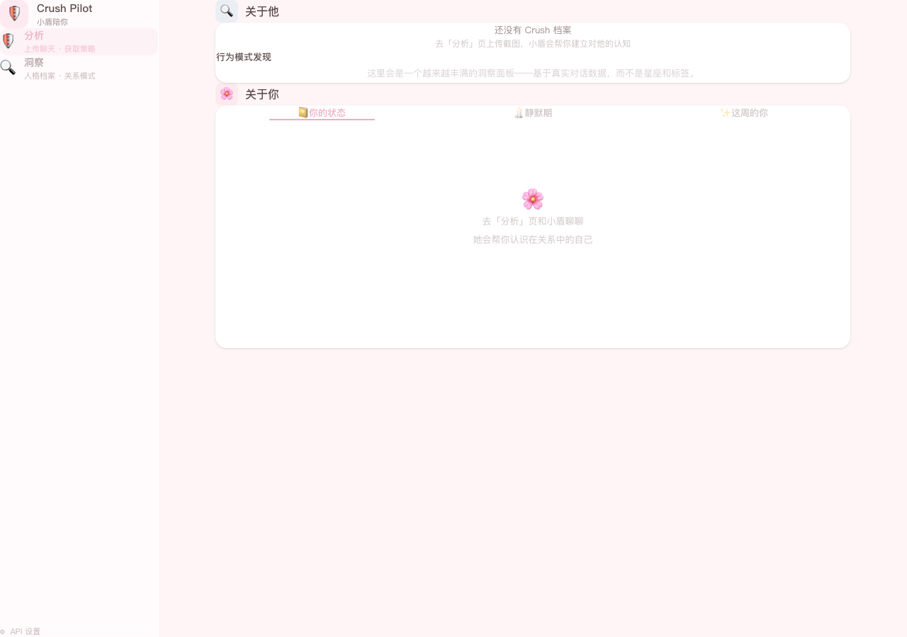

# Crush Pilot 产品草图作业

> 提交人：Echo Li  
> 日期：2026-05-19  
> 版本：原型 v1.0

---

## 一、产品概述

**Crush Pilot** 是一款帮助年轻女性在暧昧关系中保持清醒、获得主体性的分析工具。通过上传聊天截图，AI 解读双方的行为模式，积累动态人格洞察，并在关键决策点提供高价值策略。

**一句话定义**：通过持续积累的对话数据，帮用户看清一个人，也看清自己。

目标用户：18-28 岁女性，正处于暧昧/不确定关系中，希望用理性数据而非情绪冲动来做关系决策。

---

## 二、产品价值

### 2.1 为什么做这个产品

市面上的聊天分析工具有两个核心缺陷：

| 现有产品的问题 | Crush Pilot 的解法 |
|---|---|
| 没有人格档案的积累机制——每次分析都是"一次性"的，无法形成对一个人的系统性认知 | **"他"线**：从每次分析中提取行为证据，累积成动态人格洞察。第一次发现"闭合式回应"，第二次印证"回避性信号"——认知随数据增长而清晰 |
| 过度提供情绪价值，帮用户"自我安慰"，缺乏清醒度和主体性 | **"我"线**：用数据帮用户意识到自己在关系里的模式（主动程度、情绪波动），保持清醒。不含星座、塔罗牌等泛娱乐化内容 |

### 2.2 两条流动的线

产品中的所有功能都围绕两条核心数据线组织：

- **"他"线（关于他）**：上传截图 → AI 分析 → 提取行为模式 → 积累人格洞察 → 策略建议
- **"我"线（关于你）**：自我档案 → 使用数据 → 关系模式发现 → 静默期工具 → 每周高光

这两条线不是割裂的，而是通过同一次分析同时更新——你在看清他的同时，也在看清自己。

---

## 三、设计思路

### 3.1 信息架构：从 3 Tab 到 2 Tab

原始设计按"功能类型"分为聊天/档案/我 三个 Tab，功能完整但割裂。

重构后按"用户任务流"分为 2 个 Tab：

| Tab | 用户任务 | 对应数据线 |
|---|---|---|
| **分析** | 上传聊天 · 获取策略 | "他"线的入口 |
| **洞察** | 人格档案 · 关系模式 | "他"线 + "我"线的沉淀 |

### 3.2 冷启动精简

旧流程：Welcome → Questionnaire（10题）→ Transition → CrushForm → Main，4 步才进入主界面，问卷填完即封存，感受不到与后续分析的连接。

新流程：Welcome → **QuickContext（6题一屏）** → Main，2 步进入主界面。

6 个问题直击要害：

| 问题 | 为什么问 |
|---|---|
| 你的称呼？他的称呼？ | AI 怎么称呼你和指代他 |
| 怎么认识的？多久了？ | 关系背景，影响策略风格 |
| 你现在最想知道什么？ | 直接影响分析方向 |
| 你在这段关系里最常有的情绪？ | 帮你认识自己的模式 |
| 还有什么要告诉我的？ | 开放入口，补充上下文 |

### 3.3 数据流动设计

分析不再是一次性的——每次上传截图后，系统从分析结果中提取结构化洞察，存入全局状态，在"洞察"页持续积累：

```
上传截图 → AI 分析 → {
    护盾语 + 客观看待（事实还原 / 情绪解读 / 清醒提醒）
    高价值策略（试探 ↔ 直接滑块）
    insights: {
        关于他: [{ 行为模式, 可信度, 证据来源 }]
        关于你: [{ 关系模式, 证据来源 }]
    }
}
        ↓
洞察页 ← 累积展示 ← personalityInsights 状态持久化
```

### 3.4 视觉系统

- **配色**：马卡龙色系（粉 #EEACC2 / 黄 #F3E49B / 蓝 #9DD9E1），柔和但不过度甜美
- **排版**：行距全部 ≥ 1.9，文字密度低，留白充足
- **卡片设计**：圆角 14px+，轻阴影，统一边框色，信息层级通过背景色区分
- **对话框**：固定宽度 400px，保证长文本换行时各气泡宽度一致

### 3.5 关键交互设计

- **静默期时钟**：启动静默后，页面显示 SVG 圆形倒计时，精确到小时和分钟，提供 6 种替代活动建议
- **策略滑块**：三段式滑动选择（试探 ↔ 适中 ↔ 直接），含淡入淡出动画和复制功能
- **洞察 Tab**：统一白色卡片包裹，内部用分割线区分功能区，"关于你"用 Tab 切换三个子视图（你的状态 / 静默期 / 这周的你）

---

## 四、关键界面

### 4.1 隐私声明

用户首次打开 App 时看到。强调数据安全——云端分析后即销毁、档案仅本地存储、不向第三方透露。



### 4.2 欢迎页

阐明产品定位：不看星盘、不算塔罗、基于真实对话数据的理性分析。



### 4.3 冷启动问卷（QuickContext）

6 个问题一屏完成，代替传统的 10 题问卷 + CrushForm。填写内容直接影响后续 AI 分析的方向和语气。



### 4.4 分析页

顶部护盾卡片 + 对话流 + 底部上传区。上传截图后 AI 返回：护盾 & 客观分析 + 高价值策略（含滑块切换）。



### 4.5 洞察页

两个核心板块：
- **关于他**：可编辑档案 + 行为模式发现（含可信度标签和证据来源）
- **关于你**：三个子 Tab（你的状态 / 静默期 / 这周的你）



---

## 五、技术实现

| 层 | 技术选型 |
|---|---|
| 前端框架 | React 19 + Vite 6 |
| 样式 | Tailwind CSS v4，自定义主题色 |
| 状态管理 | React Context API（AppContext） |
| AI 接入 | DeepSeek Chat API（deepseek-chat 模型） |
| 数据持久化 | localStorage（用户档案、洞察积累、静默历史） |
| OCR（规划中） | Tesseract.js 浏览器端识别（CDN 问题暂时搁置） |

### 文件结构

```
src/
├── App.jsx                          # 路由 + demo 模式入口
├── context/AppContext.jsx           # 全局状态（屏幕、档案、洞察、静默期）
├── screens/
│   ├── Welcome.jsx                  # 欢迎页
│   ├── QuickContext.jsx             # 精简冷启动（6题一屏）
│   └── MainLayout.jsx              # 主布局（侧边栏 + 内容区）
├── components/
│   ├── chat/
│   │   ├── ChatView.jsx            # 分析页（对话流 + 上传）
│   │   ├── MessageBubble.jsx       # 消息气泡
│   │   ├── ShieldCard.jsx          # 护盾卡片
│   │   ├── AnalysisResult.jsx      # AI 分析结果（护盾+客观+策略）
│   │   └── StrategySlider.jsx      # 策略滑块
│   ├── insight/
│   │   └── InsightView.jsx         # 洞察页（关于他 + 关于你）
│   ├── me/
│   │   ├── SilentPeriod.jsx        # 静默期工具（时钟 + 历史 + 活动建议）
│   │   └── WeeklyHighlight.jsx     # 每周高光卡片
│   └── shared/
│       ├── BottomTabBar.jsx        # 侧边栏导航
│       ├── PrivacyModal.jsx        # 隐私声明
│       └── SettingsModal.jsx       # 设置弹窗
└── services/
    └── api.js                      # DeepSeek API 调用 + 系统提示词
```

---

## 六、后续规划

1. **OCR 真实截图识别**：接入 Tesseract.js 或云端 OCR，让用户上传真实聊天截图
2. **更长周期的洞察积累**：基于 10+ 次分析后的趋势报告（"这一个月来他的回应模式变化"）
3. **更多行为模式维度**：从目前的回应节奏、语言模式，扩展到情感温度、话题主导权等
4. **导出报告**：生成可分享/保存的 PDF 关系洞察报告
